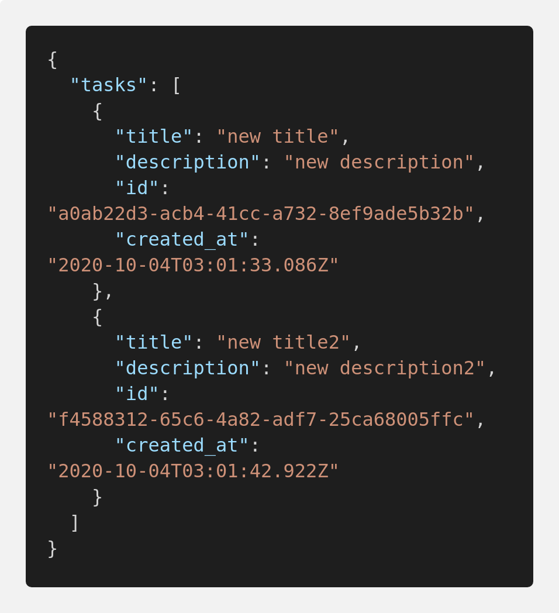

# LOWDB API FOR TASKS

## description:
#### A simple example for tasks api made with lowDB, Express, Node.js

## developed with:
Language: 
 - Javascript

Technologies:
1. Node.JS:
    - Express
    - LowDB
    - Node.JS
2. Styling code and tools:
    - Morgan
    - Nodemon
    - Husky
    - ConventionalCommits
    - ESlint
    - Prettier
    
## test:
    - git clone https://github.com/lucabecci/lowDB-api
    - cd lowdb-api
    - npm install
    - npm start
## Project structure:

    |-- src
        |-- controllers
            |-- task.controller.js
        |-- database
            |-- database.js
        |-- routes
            |-- task.routes.js
        |-- app.js
        |-- index.js
    |-- .eslintrc.js
    |-- .gitignore
    |-- .prettierignore
    |-- .prettierrc.json
    |-- commitlint.config.js
    |-- db.json
    |-- db.png
    |-- package-lock.json
    |-- package.json
    |-- README.md

## Database structure

